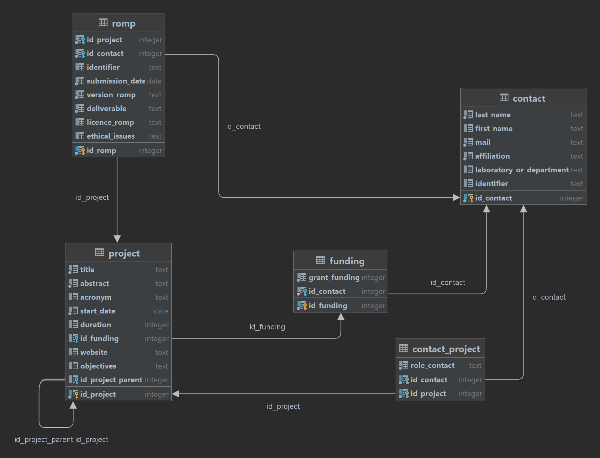

# DB - DMP

###### Version du 8 juin 2022

> ###### `/idea` : dossier pour l'IDE 

## Infos :

>### Utilisation de `CHECK IN` au lieu des **`ENUM`** pour :
>
> > **Contact** 
> > - (**type_contact**) **:** `{Organization', 'Person'}`
> >
> >
> > - (**role_contact**) **:** `{'Coordinator', 'DMP_Leader', 'WP_Participant'}`
>
>  > **ROMP**
> > - (**licence_romp**) **:** (`CC-BY-4.0` par défaut) sinon **:** `{CC-BY-4.0', 'CC-BY-NC-4.0', 'CC-BY--ND-4.0', 'CC-BY--SA-4.0', 'CC0-1.0'}`
> 
> > **Research_Output** 
> > - (**ro_cost**)  **:**  `{Organization', 'Person'}`
> >
> >
> > - (**ro_type**)  **:**  `{Data Set', 'Service', 'Data Paper', 'Publication', 'Software', 'Model'}`
>
> > **Distribution** 
> > - (**access_distribution**)  **:** `{Open', 'On Demand', 'Embargo'}`
> >
> >
> > - (**size_unit**) **:** `{Ko', 'Mo', 'Go', 'To', 'Po'}`

### Utilisation du type JSON pour :
> 
> > **Research_Output**
> > - **ro_cost :** `{type":ENUM, "value":FLOAT, "unit":STRING}`
> > > _type_ **:** `{ Storage / Archiving / Re-Use / Other }`
> > - **keyword :** `{"keywords de l'API"}` 

## (ACTUAL) DB Diagram
>
>###### Diagramme de la base de données actuelle après le script `CURRENT_Script.sql`
>
>

## (GLOBAL) DB Diagram
>
>###### Diagramme de la base de données actuelle après le script `GLOBAL_Script.sql`
>
>

